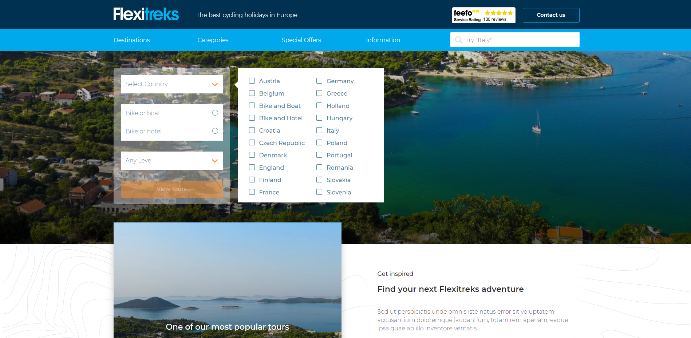

# vue-node-flexitreks

-vue website  
-vue admin dashboard  
-node/postgres/knex api  

  

1. How to import postgreSQL DB
psql -U postgres -h localhost -d flexitreks_dev -f "D:/flexiPgDump.sql"

<kbd>
	
</kbd>
